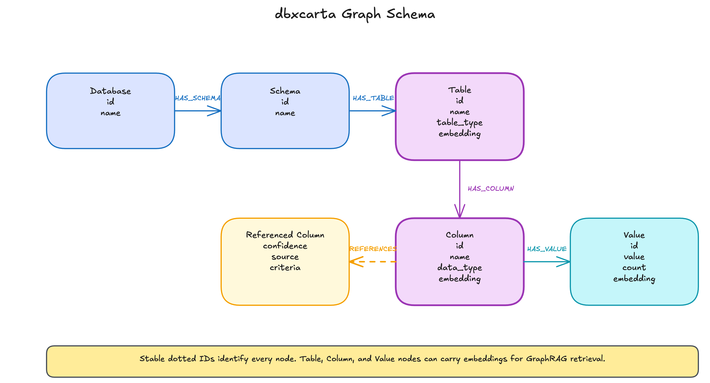

# dbxcarta

*Inspired by [neocarta](https://github.com/neo4j-field/neocarta).*

dbxcarta builds a metadata knowledge graph in Neo4j from Unity Catalog. The graph serves as a semantic layer for **GraphRAG** workflows: a Text2SQL agent, MCP tool, or schema-aware RAG pipeline queries the graph at runtime to retrieve the schema context it needs before generating SQL.

The build pipeline extracts Unity Catalog metadata, including table names, column descriptions, comments, and sampled values, embeds each piece using a Databricks foundation model, and writes the result to Neo4j as typed nodes with vector properties. At query time, a client embeds a user question, runs a similarity search to find the most relevant schema nodes, then follows graph relationships to expand that seed set into a full schema subgraph: columns, values, and foreign-key references, all in one retrieval step before the LLM call.

The graph follows a stable, typed schema:

- **Nodes**: `Database`, `Schema`, `Table`, `Column`, `Value`
- **Relationships**:
  - `(:Database)-[:HAS_SCHEMA]->(:Schema)`
  - `(:Schema)-[:HAS_TABLE]->(:Table)`
  - `(:Table)-[:HAS_COLUMN]->(:Column)`
  - `(:Column)-[:HAS_VALUE]->(:Value)`
  - `(:Column)-[:REFERENCES]->(:Column)` from declared and inferred foreign keys

Each node carries a stable dotted `id` such as `catalog.schema.table.column`, a `description`, and where applicable an `embedding` vector for semantic similarity search.

## Use dbxcarta as a library

Core dbxcarta does not create Lakehouse tables. It builds a semantic layer over
an existing Unity Catalog scope configured by `DBXCARTA_CATALOG` and
`DBXCARTA_SCHEMAS`.

Outside applications can depend on dbxcarta as a normal Python package, build
their own `Settings`, and call the ingest function directly from code running
with Databricks Spark access:

```python
from dbxcarta import Settings, run_dbxcarta

settings = Settings(
    dbxcarta_catalog="analytics",
    dbxcarta_schemas="finance,customer_success",
    dbxcarta_summary_volume="/Volumes/analytics/ops/dbxcarta/summaries",
    dbxcarta_summary_table="analytics.ops.dbxcarta_runs",
    dbxcarta_include_embeddings_tables=True,
    dbxcarta_include_embeddings_columns=True,
)

run_dbxcarta(settings=settings)
```

The no-argument form, `run_dbxcarta()`, is the Databricks wheel entrypoint used
by the CLI. It loads the same `Settings` model from environment variables and
then runs the same pipeline.

## Examples and presets

Companion examples show how to package reusable configuration for a known
upstream project:

- `examples/finance-genie/` pairs dbxcarta with
  `/Users/ryanknight/projects/databricks/graph-on-databricks/finance-genie`.
  Finance Genie creates the finance Lakehouse tables and Gold graph-enriched
  features; dbxcarta creates the Neo4j semantic layer over those tables.

### Example preset: Finance Genie

The Finance Genie preset is the maintained example of dbxcarta CLI automation.
It lives in `examples/finance-genie/` as its own Python package
(`dbxcarta-finance-genie-example`) that depends on dbxcarta as a normal pip
dependency. dbxcarta core itself ships no preset implementations.

See [`examples/finance-genie/README.md`](examples/finance-genie/README.md) for
the complete setup, validation flow, and the template a new preset package
should follow.

Install the example package alongside dbxcarta, then pass its import path to the
CLI when you want repeatable environment overlays or demo automation:

```bash
uv pip install -e examples/finance-genie/
uv run dbxcarta preset dbxcarta_finance_genie_example:preset --print-env
```

Check whether the expected Finance Genie tables are present:

```bash
uv run dbxcarta preset dbxcarta_finance_genie_example:preset --check-ready --strict-optional
```

Upload the preset's demo question set to the configured UC Volume:

```bash
uv run dbxcarta preset dbxcarta_finance_genie_example:preset --upload-questions
```

## Public API and version contract

External projects depend on dbxcarta as a normal pip package. The primary
public surface is whatever `dbxcarta/__init__.py` re-exports today:

- Pipeline entrypoints: `run_dbxcarta`, `run_client`, plus the installed
  wheel entrypoints `dbxcarta-ingest` and `dbxcarta-client`, submitted through
  `uv run dbxcarta submit-entrypoint {ingest|client}`.
- Settings: `Settings` (pydantic-settings model). Pass explicit field values
  from code, or let the no-argument CLI/job path load the same fields from env
  vars.
- Preset protocol: `Preset`, `ReadinessReport`, `load_preset`, `format_env`.
  A preset is a small configuration adapter published by an external package
  and referenced by an import-path spec like `your_pkg.module:preset`. Optional
  readiness and question-upload hooks live in `dbxcarta.presets` for CLI and
  demo integrations; they are not required for library consumption.
- Verification: `verify_run`, `Report`, `Violation`.
- Contract enums and constants: `NodeLabel`, `RelType`, `EdgeSource`,
  `CONTRACT_VERSION`, `REFERENCES_PROPERTIES`.
- Databricks helpers used by external presets: `validate_identifier`,
  `validate_uc_volume_subpath`, `build_workspace_client`.

Anything not in `__init__.py` is internal even if importable. Removing or
renaming any name in the list above is a breaking change and rolls the
major version. Adding new names is additive and rolls the minor version. The
exception is `dbxcarta.presets`, which also exposes optional CLI/demo extension
protocols for preset packages.

## Quickstart

This path creates the demo Unity Catalog schemas, builds the Neo4j semantic
layer, then runs the demo client against that graph.

### 1. Configure the project

```bash
uv sync
cp .env.sample .env
```

Open `.env` and replace the placeholders. Keep the demo defaults already
organized in `.env.sample`: the four `dbxcarta_test_*` schemas, table and
column embeddings enabled, values enabled, `DBXCARTA_CLIENT_ARMS=graph_rag`,
and `DBXCARTA_CLIENT_QUESTIONS` pointing at the UC Volume copy of
`demo_questions.json`.

Use an existing UC catalog, schema, and volume, or create them if your
principal has permission:

```bash
uv run dbxcarta schema create <catalog>.<schema>
uv run dbxcarta volume create <catalog>.<schema>.<volume>
```

Create the Neo4j secrets in Databricks. These keys are read from the secret
scope at job runtime.

```bash
./setup_secrets.sh --profile <your-profile>
```

If the Neo4j database already has dbxcarta data, clear it before the first demo
run so constraints and vector indexes are created cleanly:

```cypher
MATCH (n) DETACH DELETE n;
```

### 2. Create the demo source schemas

`scripts/run_demo.py` uses `DBXCARTA_CATALOG`, `DATABRICKS_WAREHOUSE_ID`, and
`DATABRICKS_VOLUME_PATH` from `.env`. It creates and populates the demo source
schemas in Unity Catalog.

```bash
uv run python scripts/run_demo.py
```

### 3. Build the semantic layer

Upload the package wheel, upload the demo questions file to the configured UC
Volume, then submit the installed wheel's ingest entrypoint.

```bash
uv run dbxcarta upload --wheel
uv run dbxcarta upload --data tests/fixtures
uv run dbxcarta submit-entrypoint ingest
```

The ingest run should finish with `status=success`. It writes the graph to
Neo4j, writes JSON run output under `DBXCARTA_SUMMARY_VOLUME`, and appends a
row to `DBXCARTA_SUMMARY_TABLE`.

### 4. Run the demo client

The demo client embeds each question, retrieves context from the Neo4j semantic
layer, asks the configured chat endpoint for SQL, executes the SQL on the
warehouse, and writes a client run summary.

```bash
uv run dbxcarta submit-entrypoint client
```

Check the job output for per-arm `executed` and `non_empty` rates:

```bash
uv run dbxcarta logs <run_id>
```

### 5. Verify and clean up

Run local tests:

```bash
uv run pytest
```

Run live integration tests after a successful ingest:

```bash
uv run pytest tests/integration -m live
```

Re-run structural verification against the most recent successful run summary:

```bash
uv run dbxcarta verify
```

Remove the demo schemas when you are done:

```bash
uv run python scripts/run_demo.py --teardown
```

## Architecture

### Graph schema



Editable source: [`docs/assets/graph-schema.excalidraw`](docs/assets/graph-schema.excalidraw).

### Build time: pipeline writes the graph

Unity Catalog metadata flows through a single Spark job that extracts, embeds, and loads every enabled node label into Neo4j. Embeddings are generated inside Spark via `ai_query` and materialized to a Delta staging table before the Neo4j write, so the embedding call happens exactly once per run.

```
┌──────────────────────────────────────────── BUILD TIME ────────────────────────────────────────────┐
│                                                                                                    │
│  ┌──────────────────┐   ┌──────────────────┐   ┌──────────────────┐   ┌──────────────────┐      │
│  │ Unity Catalog    │──►│ Preflight        │──►│ Extract          │──►│ Transform        │      │
│  │ information_schema│   │ permission check │   │ SQL to DataFrames│   │ typed graph rows │      │
│  └──────────────────┘   └──────────────────┘   └──────────────────┘   └──────────────────┘      │
│                                                                            │                       │
│                                                                            ▼                       │
│  ┌──────────────────┐   ┌──────────────────┐   ┌──────────────────┐                                │
│  │ Neo4j (Aura)     │◄──│ Delta Staging    │◄──│ Embed            │                                │
│  │ MERGE + indexes  │   │ materialized rows│   │ ai_query/label   │                                │
│  └──────────────────┘   └──────────────────┘   └──────────────────┘                                │
│                                                                                                    │
└────────────────────────────────────────────────────────────────────────────────────────────────────┘
```

* **Unity Catalog**: reads source metadata from `information_schema`, including tables, columns, schemas, and sampled values.
* **Preflight**: checks grants, endpoint access, and required configuration before the Spark job does any expensive work.
* **Extract**: queries Unity Catalog metadata into Spark DataFrames for each enabled node and relationship type.
* **Transform**: shapes raw metadata into stable graph rows with typed labels, dotted IDs, descriptions, and relationship keys.
* **Embed**: calls `ai_query` inside Spark for each enabled label, with row-level failures captured instead of aborting the whole run.
* **Delta Staging**: materializes enriched rows once so validation, summaries, and Neo4j writes reuse the same embedding results.
* **Neo4j**: writes nodes and relationships with `MERGE`, then creates or updates the vector indexes used at query time.

### Query time: client retrieves schema context

A client performs two steps: a vector similarity search to find the most relevant nodes, then a graph traversal to expand that seed set into a full schema subgraph. The combination delivers both semantic relevance and structural completeness: the LLM receives the right tables *and* their columns, values, and relationships.

```
┌──────────────────────────────────────────── QUERY TIME ────────────────────────────────────────────┐
│                                                                                                    │
│  ┌──────────────────┐   ┌──────────────────┐   ┌──────────────────┐   ┌──────────────────┐      │
│  │ User Question    │──►│ Client           │──►│ Embed Question   │──►│ Vector Search    │      │
│  │ natural language │   │ Text2SQL/MCP/RAG │   │ query vector     │   │ top-k graph nodes│      │
│  └──────────────────┘   └──────────────────┘   └──────────────────┘   └──────────────────┘      │
│                                                                            │                       │
│                                                                            ▼                       │
│  ┌──────────────────┐   ┌──────────────────┐   ┌──────────────────┐                                │
│  │ SQL / Answer     │◄──│ LLM              │◄──│ Graph Traversal  │                                │
│  │ generated result │   │ combined context │   │ schema subgraph  │                                │
│  └──────────────────┘   └──────────────────┘   └──────────────────┘                                │
│                                                                                                    │
└────────────────────────────────────────────────────────────────────────────────────────────────────┘
```

* **User Question**: starts as a natural-language request from a Text2SQL, MCP, or schema-aware RAG workflow.
* **Client**: coordinates retrieval by embedding the question, querying Neo4j, assembling context, and calling the LLM.
* **Embed Question**: converts the user question into the same vector space used by table, column, and value embeddings.
* **Vector Search**: finds the most semantically relevant `Table`, `Column`, and `Value` nodes using cosine similarity and Neo4j vector indexes.
* **Graph Traversal**: expands the top-k seed nodes through `HAS_COLUMN`, `HAS_VALUE`, and `REFERENCES` relationships.
* **LLM**: receives the combined schema context and produces the final SQL or answer.
* **SQL / Answer**: returns the generated query or response to the calling workflow.

## Design

Everything runs inside Databricks — no external orchestrators, no local execution, no service accounts.

- **Single submission**: one installed wheel entrypoint (`dbxcarta-ingest`, submitted with `dbxcarta submit-entrypoint ingest`) drives the whole pipeline in one Databricks Job. Phases are no longer dispatched via `DBXCARTA_JOB`; scope is controlled by per-label embedding flags in `.env`.
- **Spark**: extraction and transformation use PySpark DataFrames, so the pipeline scales to large catalogs without single-process bottlenecks.
- **Model Serving**: embeddings are generated in Spark via `ai_query` against a Databricks-hosted foundation model endpoint (`databricks-gte-large-en` by default), with `failOnError => false` so row-level failures are counted rather than thrown.
- **Materialize-once**: enriched node DataFrames are written to a Delta staging table between transform and load, so the failure-rate aggregation and the Neo4j write both consume the staged rows without re-invoking `ai_query`.
- **Neo4j Spark Connector**: bulk, partitioned writes from DataFrames. Relationship writes are `coalesce(1)` to avoid endpoint-node lock contention on Aura; `batch.size` is tuned via `DBXCARTA_NEO4J_BATCH_SIZE`.
- **Preflight**: grants and serving-endpoint permissions required by the enabled flags are checked before any extract runs; missing permissions fail the run fast.
- **Secrets**: Neo4j credentials live in a Databricks secret scope and are injected at job time, not read from a local file.
- **Metadata source**: Unity Catalog `information_schema` only — no pluggable multi-source connector layer.
- **Run observability**: every run emits a `RunSummary` to stdout, a timestamped JSON file in a UC Volume, and a row appended to a Delta table (`CREATE TABLE IF NOT EXISTS`, schema-merge on write) so history is queryable via SQL. The summary records per-label embedding attempts, successes, and failure rates alongside the threshold and the endpoint used.
- **`databricks-job-runner`**: CLI wrapper around the Databricks SDK that handles upload, submit, and cleanup.

See `docs/reference/best-practices.md` for the design rules (Spark / Databricks, Neo4j Spark Connector, project-level principles) that shape the pipeline.

## Configuration

All pipeline and client behavior is controlled by `.env`. Copy
`.env.sample`, fill in the placeholders, and use the comments in that file as
the configuration reference. The sample is organized by Databricks auth,
workspace locations, compute, secrets, Unity Catalog scope, run artifacts,
embeddings, Neo4j write tuning, and client settings.

## Demo Client Details

The client is a batch evaluation job for the Neo4j semantic layer. In the
quickstart it runs the `graph_rag` arm against `tests/fixtures/demo_questions.json`
after that file is uploaded to `DATABRICKS_VOLUME_PATH`.

The question set exercises cross-schema joins (`sales` to `inventory` and
`sales` to `hr`), self-referential FKs, composite FK paths, and intra-schema
event analytics. For your own catalog, upload a replacement questions JSON file
to the UC Volume and point `DBXCARTA_CLIENT_QUESTIONS` at it.

## Automated end-to-end test

`scripts/run_autotest.py` is a self-contained harness that provisions a known fixture schema in Unity Catalog, runs the full pipeline against it, and asserts the resulting `RunSummary` JSON meets expected thresholds. It produces a dated JSON result file in the configured volume and exits non-zero on any failure.

**Prerequisites** — the following must be set in `.env` (or the environment):

| Variable | Purpose |
|----------|---------|
| `DATABRICKS_PROFILE` | Databricks CLI profile for auth |
| `DATABRICKS_CLUSTER_ID` or `DATABRICKS_COMPUTE_MODE=serverless` | Compute for the pipeline job |
| `DATABRICKS_WAREHOUSE_ID` | SQL warehouse used for schema setup |
| `DBXCARTA_CATALOG` | Must be `dbxcarta-catalog` |
| `DBXCARTA_SUMMARY_VOLUME` | UC Volume path where `RunSummary` JSON and autotest results are written |

**Run:**

```bash
uv run python scripts/run_autotest.py
```

**Phases:**

| Phase | What it does |
|-------|-------------|
| 0 — Preflight | Verifies workspace connectivity and that the SQL warehouse is reachable |
| 1 — Unit test gate | Runs the fast offline pytest suite; aborts if any test fails |
| 2 — Schema setup | Tears down and recreates the fixture schemas (`dbxcarta_test_{sales,inventory,hr,events}`) in `dbxcarta-catalog` using `tests/fixtures/setup_test_catalog.sql` |
| 3 — Ingest run | Builds and uploads the wheel, submits `dbxcarta-ingest`, waits for `SUCCESS`, and downloads the `RunSummary` JSON |
| 4 — Assertions | Validates the `RunSummary`: `status=success`, `error=null`, `schemas >= 4`, `tables >= 19`, `fk_declared >= 16`, `fk_edges >= 16`, `neo4j_counts` non-empty |
| 5 — Output JSON | Writes `autotest_results_<ts>.json` to `DBXCARTA_SUMMARY_VOLUME/autotest/` and locally to `outputs/` (git-ignored) |

The fixture covers all the structural edge cases:

- **Cross-schema FKs**: sales → hr, sales → inventory
- **Self-referential FK**: `employees.manager_id`
- **Composite PK / associative table**: `product_suppliers`
- **Complex column types**: `STRUCT`, `ARRAY`, `MAP`, `VARIANT`, `BINARY`
- **External schema** (`dbxcarta_test_external`): requires a UC Volume path; excluded from ingest but included in teardown

**Notes:**
- The harness locates the `RunSummary` via a before/after volume diff — `DATABRICKS_JOB_RUN_ID` is not set for one-time `runs.submit()` jobs, so the file is always written as `dbxcarta_local_<ts>.json`.
- Schema setup and teardown are idempotent — re-running always starts from a clean state.
- Unit tests run with `--ignore=tests/integration` to exclude slow live-catalog suites.
- Results are also written locally to `outputs/autotest_results_<ts>.json` (git-ignored) for quick inspection without going back to the volume.

## Upload and submit

### Supply-chain checks

Run the local supply-chain checks before submitting a changed package to
Databricks:

```bash
uv lock --check
uv sync --frozen --extra test
uv run pytest
rm -rf dist
uv build --sdist --wheel
uv run python scripts/security/artifact_audit.py inspect dist
uv run python scripts/security/artifact_audit.py provenance dist \
  --output dist/supply-chain-provenance.json
```

The provenance file records the source commit, lockfile hash, package version,
and SHA256 hashes for built artifacts. Treat it as audit evidence for the
reviewed artifacts.

**`upload`**
- `--wheel` — builds the package, bumps the patch version, and uploads the wheel to `DATABRICKS_VOLUME_PATH/wheels/`. Re-run whenever `src/dbxcarta/` changes.
- `--all` — copies every `scripts/*.py` to the workspace. Re-run whenever `scripts/` changes.

**`submit <script>`**

The script name is relative to `scripts/`. Scripts named `run_dbxcarta*` auto-attach the latest uploaded wheel. All non-Databricks `.env` variables are forwarded to the job.

Supply-chain note: `upload --wheel` currently combines version bumping,
building, and UC Volume upload. For reviewed releases, prefer a CI-built wheel
and provenance manifest as the artifact of record. A future hardening step
should make Databricks submission select a wheel by explicit version or hash
instead of by latest local wheel mtime.

- `--upload` — uploads `scripts/*.py` before submitting, replacing a separate `upload --all` step.
- `--no-wait` — returns immediately with the run ID.
- `--compute {cluster,serverless}` — overrides `DATABRICKS_COMPUTE_MODE` for this run.
